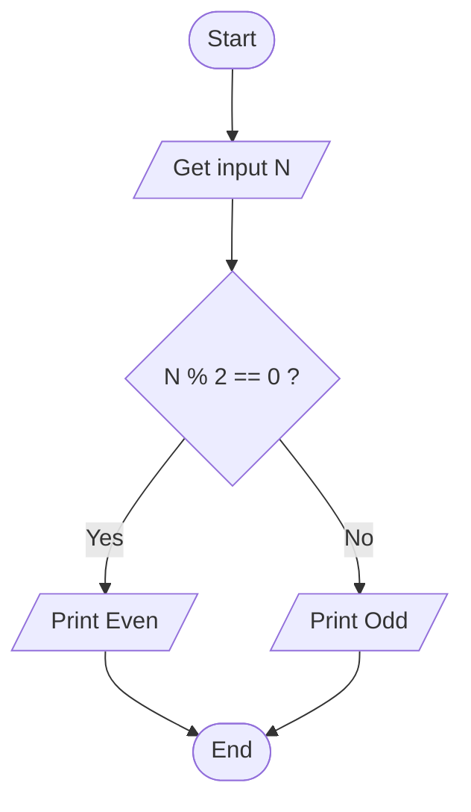
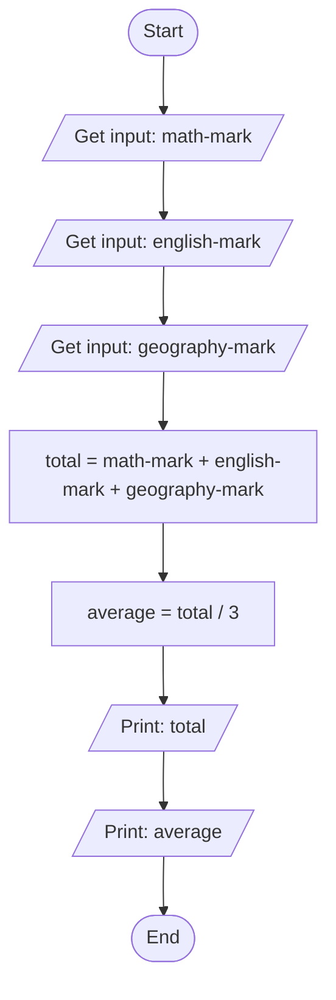
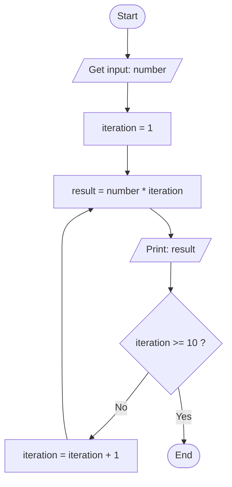
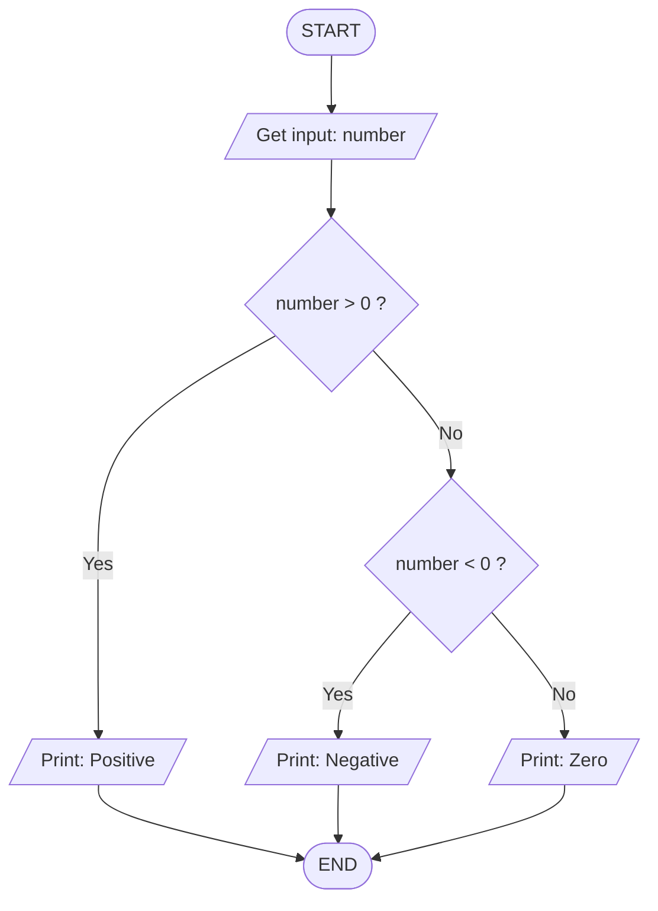
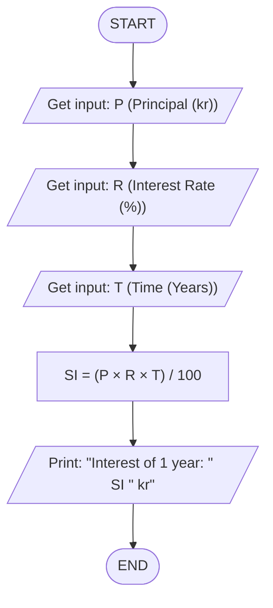
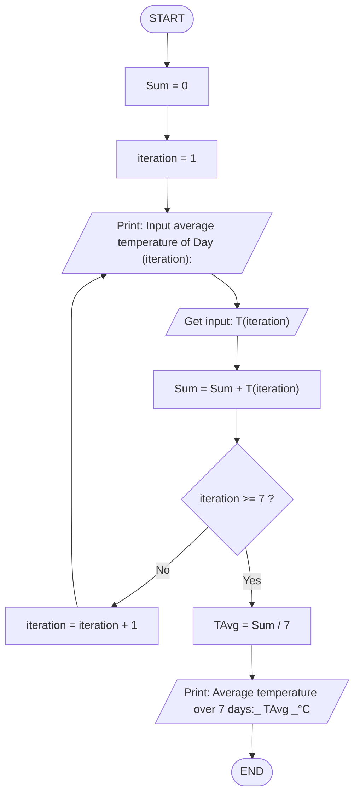
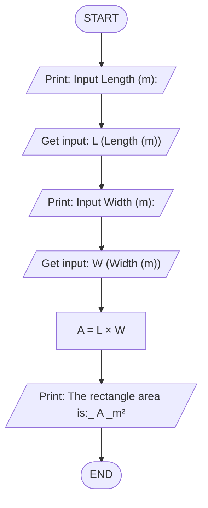

# Workshop: Algorithm and Flowchart

For each question in this workshop, you must complete **two** things:

1.  **Write the pseudocode**
2.  **Draw the flowchart** using either
    - **Option 1:** Draw.io (recommended) → export image → upload to
      your repository → link it in this file
    - **Option 2 (optional):** Write a Mermaid flowchart directly in
      Markdown
    - **Option 3 (optional):** Any other valid method

👉 **IMPORTANT:** At the **bottom of each question**, add the
following sections:

### ✔ Pseudocode

### ✔ Flowchart

---

## 1. Check Even or Odd Number

GitHub link to my draw.io flowchart image: [Flowchart image](https://github.com/JiHo51/g63-ws-algorithm-flowchart/blob/main/Task1%20-%20Flowchart.drawio.png)

Design an algorithm and flowchart that take a number as input and
determine whether it is even or odd.

### ✔ Pseudocode

```text
START
    INPUT number
    IF number % 2 == 0 THEN
        PRINT Even
    ELSE
        PRINT Odd
    ENDIF
END
```

### ✔ Flowchart



---

## 2. Calculate Total and Average Marks

Write the algorithm and draw the flowchart for a program that inputs
marks for 3 subjects, calculates the total and average, and displays
both.

### ✔ Pseudocode

```text
START
	INPUT math-mark
	INPUT english-mark
	INPUT geography-mark

	total = math-mark + english-mark + geography-mark
	average = total / 3

	PRINT total
	PRINT average
END
```

### ✔ Flowchart

GitHub link to my draw.io flowchart image: [Flowchart image](https://github.com/JiHo51/g63-ws-algorithm-flowchart/blob/main/Task2%20-%20Flowchart.drawio.png)



---

## 3. Display Multiplication Table

Create an algorithm and flowchart that input a number and display its
multiplication table from 1 to 10 using a loop.

### ✔ Pseudocode

```text
START
	INPUT number
	For iteration 1 to 10
		result = number * iteration
		PRINT result
	EndFor
END
```

### ✔ Flowchart

GitHub link to my draw.io flowchart image: [Flowchart image](https://github.com/JiHo51/g63-ws-algorithm-flowchart/blob/main/Task3%20-%20Flowchart.drawio.png)



---

## 4. Positive, Negative, or Zero Check

Write the algorithm and flowchart to input a number and display whether
it is positive, negative, or zero.

### ✔ Pseudocode

```text
START
	INPUT number
	IF number > 0 THEN
		PRINT Positive
	IF number < 0 THEN
		PRINT Negative
	ELSE
		PRINT Zero
	ENDIF
END
```

### ✔ Flowchart

GitHub link to my draw.io flowchart image: [Flowchart image](https://github.com/JiHo51/g63-ws-algorithm-flowchart/blob/main/Task4%20-%20Flowchart.drawio.png)



---

## 5. Simple Interest Calculator

Create an algorithm and flowchart for a program that calculates simple
interest using the formula:

**SI = (P × R × T) / 100**

- **P = Principal** → original amount of money
- **R = Rate of Interest** → percentage per year
- **T = Time** → number of years

### ✔ Pseudocode

```text
START
	INPUT P (Principal (kr))
	INPUT R (Interest Rate (%))
	INPUT T (Time (Years))

	SI = (P × R × T) / 100

	PRINT "Interest of 1 year: " SI " kr"
END
```

### ✔ Flowchart

GitHub link to my draw.io flowchart image: [Flowchart image](https://github.com/JiHo51/g63-ws-algorithm-flowchart/blob/main/Task5%20-%20Flowchart.drawio.png)



---

## 6. Average Temperature Calculation

Write the algorithm and draw the flowchart for a program that takes the
temperature of 7 days, finds the average temperature, and displays it.

### ✔ Pseudocode

```text
START
	Sum = 0
	For iteration 1 to 7
		PRINT "Input average temperature of Day (iteration):"
		INPUT T(iteration)
		Sum = Sum + T(iteration)
	EndFor
	TAvg = Sum / 7
	PRINT "Average temperature over 7 days: " TAvg " °C"
END
```

### ✔ Flowchart

GitHub link to my draw.io flowchart image: [Flowchart image](https://github.com/JiHo51/g63-ws-algorithm-flowchart/blob/main/Task6%20-%20Flowchart.drawio.png)



---

## 7. Calculate Area of a Rectangle

Create an algorithm and flowchart to input length and width, calculate
the area (**Area = Length × Width**), and display the result.

### ✔ Pseudocode

```text
START
	PRINT "Input Length (m):"
	INPUT L (Length (m))

	PRINT "Input Width (m):"
	INPUT W (Width (m))

	A = L × W

	PRINT "The rectangle area is: " A " m²"
END
```

### ✔ Flowchart

GitHub link to my draw.io flowchart image: [Flowchart image](https://github.com/JiHo51/g63-ws-algorithm-flowchart/blob/main/Task7%20-%20Flowchart.drawio.png)



---

## 8. Determine Pass or Fail

Write the algorithm and draw the flowchart for a program that takes a
student's average marks and displays **"Pass"** if average ≥ 50,
otherwise **"Fail"**.

---

## 9. Calculate Factorial of a Number

Write the algorithm and draw the flowchart that input a number and
calculate its factorial using a loop.

---

## 10. Calculate Discount on Purchase

Write the algorithm and draw the flowchart for a program that inputs the
purchase amount and gives a **10% discount** if the amount is greater
than 1000.

---


## Optional Exercises (11–16)

## 11. Online Shopping Delivery Eligibility

Write the algorithm and draw the flowchart for a program that inputs a
customer's purchase amount and displays **"Free Delivery"** if the
amount is 500 SEK or more; otherwise display **"Delivery Charge
Applies"**.

---

## 12. Employee Salary and Bonus Calculator

Write the algorithm and draw the flowchart for a program that inputs an
employee's monthly salary and years of service, calculates a bonus of
**10%** for employees with 5 or more years of service and **5%** for
others, then displays the bonus and total salary.

---

## 13. Mobile Data Usage Monitor

Write the algorithm and draw the flowchart for a program that inputs a
user's monthly data limit and data usage, then displays whether the user
has exceeded the limit or how much data remains.

---

## 14. Login System (Maximum 3 Attempts)

Create an algorithm and flowchart for a login system that allows a user
up to 3 attempts to enter the correct password. Display **"Access
Granted"** if the password is correct; otherwise display **"Account
Locked"** after 3 failed attempts.

---

## 15. Store Checkout with Multiple Items

Write the algorithm and draw the flowchart for a program that inputs the
number of items purchased, calculates the total purchase amount using a
loop, and applies a **15% discount** if the total exceeds 5000 SEK.

---

## 16. Electricity Bill Calculator

Write the algorithm and draw the flowchart for a program that inputs the
number of electricity units consumed and calculates the total bill using
the following rates: first 100 units at 1.5 SEK per unit, next 200
units at 2.0 SEK per unit, and all remaining units at 3.0 SEK per unit.

---
